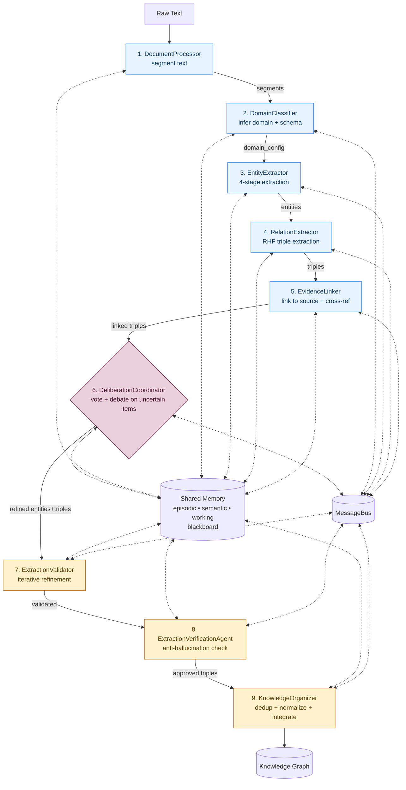

# AGENT_SCHEMA.md — Multi-Agent Knowledge Graph Framework

**Purpose.** This document is the single reference for the **agent schema** of the *Multi-Agent Knowledge Graph Framework* (`multi-agent-kg`). It is intended to be dropped directly into the NeurIPS 2026 paper draft as the "System / Agent Schema" section. For every agent it specifies: **role, inputs, instruction/prompt, tools, output**. It also documents the **pipeline order** (which agent runs first, which runs last), the deliberation sub-system, and the shared infrastructure that every agent depends on.

All statements below are grounded in the current code base:

- Orchestrator: `@/Users/neelmokaria/Documents/Coding Projects/Projects/MIND Labs KG Project/agents/multi-agent-kg/multi_agent_kg/core/deliberative_orchestrator.py`
- Agents: `@/Users/neelmokaria/Documents/Coding Projects/Projects/MIND Labs KG Project/agents/multi-agent-kg/multi_agent_kg/agents/`
- Deliberation: `@/Users/neelmokaria/Documents/Coding Projects/Projects/MIND Labs KG Project/agents/multi-agent-kg/multi_agent_kg/core/deliberation.py`
- Shared memory / bus: `@/Users/neelmokaria/Documents/Coding Projects/Projects/MIND Labs KG Project/agents/multi-agent-kg/multi_agent_kg/core/memory.py`, `@/Users/neelmokaria/Documents/Coding Projects/Projects/MIND Labs KG Project/agents/multi-agent-kg/multi_agent_kg/core/communication.py`

---

## 1. System Overview

The framework constructs a **Knowledge Graph (KG)** from raw text using **8 specialized LLM-backed agents** plus a **DeliberationCoordinator**. The orchestrator `DeliberativeOrchestrator` runs **9 pipeline stages** on each document and merges the result into a shared `KnowledgeGraph`.

Agents are divided into two roles:

- **Worker agents (5)** — do extraction work: `DocumentProcessor`, `DomainClassifier`, `EntityExtractor`, `RelationExtractor`, `EvidenceLinker`.
- **Coordinator agents (3)** — validate / verify / integrate: `ExtractionValidator`, `ExtractionVerificationAgent`, `KnowledgeOrganizer`.

Between workers and coordinators, the **DeliberationCoordinator** runs a multi-agent **voting + debate** round over *uncertain* items (confidence in the band 0.35 – 0.65).

---

## 2. Pipeline Diagram

### 2.1 Sequence (first → last)

The orchestrator `DeliberativeOrchestrator.process_document()` in `@/Users/neelmokaria/Documents/Coding Projects/Projects/MIND Labs KG Project/agents/multi-agent-kg/multi_agent_kg/core/deliberative_orchestrator.py:287-506` runs these stages in strict order:

1. **DocumentProcessor** *(first)*
2. **DomainClassifier**
3. **EntityExtractor**
4. **RelationExtractor**
5. **EvidenceLinker**
6. **DeliberationCoordinator** (multi-agent voting + optional debate)
7. **ExtractionValidator**
8. **ExtractionVerificationAgent**
9. **KnowledgeOrganizer** *(last)*

### 2.2 ASCII Block Diagram

```
                        ┌──────────────────────────────────────────┐
                        │           SHARED INFRASTRUCTURE          │
                        │  SharedMemory  •  MessageBus  •  KG      │
                        │  (episodic, semantic, working, blackboard)│
                        └──────────────────────────────────────────┘
                                            ▲
                                            │  read / write / post
                                            │
  RAW TEXT                                  │
     │                                      │
     ▼                                      │
  ┌───────────────────┐   segments          │
  │ 1. DocumentProcessor│────────────────────┤
  └───────────────────┘                     │
     │                                      │
     ▼                                      │
  ┌───────────────────┐  domain + schema    │
  │ 2. DomainClassifier│────────────────────┤
  └───────────────────┘                     │
     │                                      │
     ▼                                      │
  ┌───────────────────┐   entities          │
  │ 3. EntityExtractor │────────────────────┤
  └───────────────────┘                     │
     │                                      │
     ▼                                      │
  ┌───────────────────┐   triples           │
  │ 4. RelationExtractor│───────────────────┤
  └───────────────────┘                     │
     │                                      │
     ▼                                      │
  ┌───────────────────┐  evidence-linked    │
  │ 5. EvidenceLinker │   triples           │
  └───────────────────┘────────────────────┤
     │                                      │
     ▼                                      │
  ┌────────────────────────────────────┐    │
  │ 6. DeliberationCoordinator         │    │
  │   (votes on uncertain items        │    │
  │    0.35 ≤ conf < 0.65; debate      │    │
  │    if conflict; weighted consensus)│◀───┤
  └────────────────────────────────────┘    │
     │  refined entities + triples          │
     ▼                                      │
  ┌───────────────────┐  validated set      │
  │ 7. ExtractionValidator│  (iterative     │
  └───────────────────┘   refinement)───────┤
     │                                      │
     ▼                                      │
  ┌───────────────────────────┐  approved_triples
  │ 8. ExtractionVerificationAgent│  rejected_triples
  └───────────────────────────┘──────────────┤
     │                                      │
     ▼                                      │
  ┌───────────────────┐  KG updated         │
  │ 9. KnowledgeOrganizer│ (dedup, norm,    │
  └───────────────────┘   add entity/triple)┘
     │
     ▼
  KNOWLEDGE GRAPH (Entity, Triple)
```

### 2.3 Mermaid Diagram (optional, for paper rendering)



---

## 3. Summary Table

| # | Agent | Role | Default LLM | LLM Tier | Output |
|---|-------|------|------------|----------|--------|
| 1 | `DocumentProcessor` | Worker | *none* (rule-based) | SMALL | `List[segment_dict]` |
| 2 | `DomainClassifier` | Worker | `qwen3:8b` | MEDIUM | `Dict[domain_config]` |
| 3 | `EntityExtractor` | Worker | `qwen3:8b` | MEDIUM | `List[entity_dict]` |
| 4 | `RelationExtractor` | Worker | `qwen3:8b` | MEDIUM | `List[triple_dict]` |
| 5 | `EvidenceLinker` | Worker | `qwen3:4b` | MEDIUM | `List[linked_triple_dict]` |
| 6 | `DeliberationCoordinator` | Orchestration layer | — | — | Accept/Reject per hypothesis |
| 7 | `ExtractionValidator` | Coordinator | `gemma3:27b` | LARGE | `{entities, triples}` |
| 8 | `ExtractionVerificationAgent` | Coordinator | `deepseek-r1:14b` | LARGE | `{entities, approved_triples, rejected_triples}` |
| 9 | `KnowledgeOrganizer` | Coordinator | `gpt-oss:20b` | MEDIUM | `{integrated_entities, integrated_triples, kg_stats}` |

**LLM assignment source:** `AGENT_MODEL_OVERRIDES` dict in `@/Users/neelmokaria/Documents/Coding Projects/Projects/MIND Labs KG Project/agents/multi-agent-kg/multi_agent_kg/agents/base.py:58-70`. Default tier mapping falls back to `gemma3:27b` for SMALL/MEDIUM/LARGE (`@/Users/neelmokaria/Documents/Coding Projects/Projects/MIND Labs KG Project/agents/multi-agent-kg/multi_agent_kg/agents/base.py:49-53`).

---

## 4. Shared Tools (available to *every* agent)

All agents inherit from `BaseAgent` (`@/Users/neelmokaria/Documents/Coding Projects/Projects/MIND Labs KG Project/agents/multi-agent-kg/multi_agent_kg/agents/base.py:98-906`) and therefore have access to the following tools:

- **LLM tool.** `call_llm(prompt, system_prompt, tier, temperature, max_tokens)` and `call_llm_with_self_consistency(..., n_samples, temperature)`. Backed by `chat_completion_json` (`@/Users/neelmokaria/Documents/Coding Projects/Projects/MIND Labs KG Project/agents/multi-agent-kg/multi_agent_kg/llm/openai_client.py`), which dispatches to either **Ollama** (default, `gemma3:27b` / per-agent override) or **OpenAI** depending on `LLM_BACKEND`. Returns parsed JSON.
- **SharedMemory tool.** `store_in_memory`, `retrieve_from_memory`, `get_entity_context`, `register_entity_alias`, `add_entity_context`. Memory types: `EPISODIC`, `WORKING`, `SEMANTIC`, `PROCEDURAL`.
- **Blackboard tool.** `post_hypothesis`, `vote_on_hypothesis`, `get_pending_hypotheses`, `resolve_hypothesis` (backed by `SharedMemory.post_to_blackboard`, `vote_on_blackboard`, `resolve_blackboard_entry`).
- **MessageBus tool.** `send_message`, `receive_messages`, `request_refinement`, `delegate_task`, `provide_feedback`. Communication types: `INFORM`, `REQUEST`, `RESPONSE`, `PROPOSE`, `ACCEPT`, `REJECT`, `REFINE`, `DELEGATE`, `FEEDBACK`.
- **Deliberation tool.** `submit_for_deliberation`, `cast_vote`, `provide_debate_argument`, `check_for_vote_requests`, `check_for_debate_requests`, `evaluate_hypothesis_for_vote` (overridden per agent).
- **Escalation tool.** `escalate_to_coordinator(reason, items, context)` — posts to blackboard + sends a `DELEGATE` message with `HIGH` priority to `ExtractionValidator`.
- **KnowledgeGraph tool.** Read-only for most agents (`self.knowledge_graph.entities`, `self.knowledge_graph.triples`); only `KnowledgeOrganizer` *writes* (`add_entity`, `add_triple`).

Unless noted otherwise, the "Tools available" section of each agent below lists the subset that agent *actually uses*.

---

## 5. Per-Agent Schema

Each agent is documented with the six fields requested:

1. **Agent Name**
2. **Description** (role)
3. **Inputs** (with types)
4. **Instruction / Prompt** (the actual system + user prompt, condensed)
5. **Tools available**
6. **Output** (with types)

Prompts are quoted verbatim where they are short enough, and summarized (with a pointer to the source file) where they are long.

---

### 5.1 Agent 1 — `DocumentProcessor`  *(Worker, entry point)*

- **File:** `@/Users/neelmokaria/Documents/Coding Projects/Projects/MIND Labs KG Project/agents/multi-agent-kg/multi_agent_kg/agents/document_processor.py`
- **Role:** Ingests and segments raw text into overlapping chunks, registers the document in shared memory. First stage of the pipeline.
- **Runs first.** No other agent runs before it.

**Inputs**

| Name | Type | Source |
|------|------|--------|
| `context` | `AgentContext` (with `document_id: str`, `text: str`) | Orchestrator |
| `source_path` | `Optional[str]` | Orchestrator (file path if available) |

**Instruction / Prompt**

- **No LLM call.** Segmentation is rule-based:
  - Unicode NFC normalization + control-character stripping (`_clean_text`)
  - Sentence-boundary split on `.!?`, then greedy packing into chunks with:
    - `min_segment_length=1500`
    - `max_segment_length=2000`
    - `overlap=150` chars (tail sentences of previous chunk re-added to next)
  - Each segment enriched with positional metadata (`segment_id`, `char_start/end`, `word_count`, `is_first/is_last`).

**Tools available / used**

- `SharedMemory.register_document` — records the raw document for cross-document entity resolution.
- `store_in_memory(EPISODIC, …)` — logs processing event.
- No LLM tool, no MessageBus send, no deliberation (rule-based).

**Output**

- Type: `ExtractionResult` where `items: List[Dict]` is a list of segment dicts of the form
  ```json
  {
    "text": "<segment text>",
    "segment_id": "<doc_id>_seg_<i>",
    "index": <int>,
    "char_start": <int>,
    "char_end": <int>,
    "word_count": <int>,
    "document_id": "<doc_id>",
    "source_path": "<path or null>",
    "is_first": <bool>,
    "is_last": <bool>
  }
  ```
- Also returns `confidence: float` derived from segment-length quality + coverage heuristics (`_calculate_confidence`).

---

### 5.2 Agent 2 — `DomainClassifier`  *(Worker)*

- **File:** `@/Users/neelmokaria/Documents/Coding Projects/Projects/MIND Labs KG Project/agents/multi-agent-kg/multi_agent_kg/agents/domain_classifier.py`
- **Role:** Discovers the document's domain **from scratch** (no predefined taxonomy) and generates a domain-specific extraction schema: entity types, relation types, and few-shot examples. Broadcasts the schema to `EntityExtractor` and `RelationExtractor` via `MessageBus`.

**Inputs**

| Name | Type | Source |
|------|------|--------|
| `context` | `AgentContext` | Orchestrator |
| `segments` | `List[Dict]` | Output of Agent 1 |

Up to `max_chars=4000` of text is sampled (first 2 + middle + last segment for long documents).

**Instruction / Prompt**

Two LLM calls; both ask the model to **invent** entity/relation types specific to the content, not to use predefined categories. Full prompts in the source file; condensed here:

- **System prompt (phase 1):**
  > You are an expert at discovering knowledge structures from scratch. NEVER use predefined schemas or standard taxonomies. Your task is to READ the document carefully and INVENT a custom schema that fits THIS content. Entity and relation types should be in `UPPER_SNAKE_CASE`.
- **User prompt (phase 1 — `DOMAIN_ANALYSIS_PROMPT`, lines 35-102):** asks the LLM to output JSON with `primary_domain`, `sub_domains[]`, `domain_description`, `confidence`, `entity_types[{type, description, priority, examples_from_text}]`, `relation_types[{type, description, source_types, target_types, priority, example_from_text}]`, `few_shot_examples`, and `extraction_parameters{complexity, knowledge_density, recommended_chunk_size, requires_coreference, has_temporal_relations, has_hierarchical_entities}`.
- **Phase 2 — `RELATION_EXAMPLES_PROMPT`, lines 106-130:** given the discovered entity + relation types, extract one concrete example sentence + subject/object per relation type.

Called with `call_llm_with_self_consistency(n_samples=3, temperature=0.4)` for phase 1, and a single `call_llm` for phase 2.

**Tools available / used**

- **LLM:** `call_llm`, `call_llm_with_self_consistency` (tier MEDIUM, override `qwen3:8b`).
- **SharedMemory:** `store_in_memory(SEMANTIC, ...)` to cache domain context.
- **MessageBus:** sends `CommunicationType.INFORM` to `EntityExtractor` (entity types + examples) and to `RelationExtractor` (relation types + examples).
- **Escalation:** `escalate_to_coordinator` when confidence below threshold.

**Output**

- Type: `ExtractionResult` with `items = [domain_config]` where `domain_config` is:
  ```python
  {
    "primary_domain": str,
    "sub_domains": List[str],
    "domain_description": str,
    "confidence": float,
    "reasoning": str,
    "key_indicators": List[str],
    "entity_types": List[{"type": str, "description": str, "priority": str, "examples_from_text": List[str]}],
    "relation_types": List[{"type": str, "description": str, "source_types": List[str], "target_types": List[str], "priority": str}],
    "entity_type_names": List[str],
    "relation_type_names": List[str],
    "entity_examples": List[Dict],
    "relation_examples": List[Dict],
    "extraction_parameters": Dict,
    "document_id": str,
  }
  ```
- `context.domain` is set to `primary_domain` for downstream agents.
- A **fallback schema** (generic PERSON/ORGANIZATION/LOCATION/…) is returned if LLM parsing fails (`_create_fallback_result`).

---

### 5.3 Agent 3 — `EntityExtractor`  *(Worker)*

- **File:** `@/Users/neelmokaria/Documents/Coding Projects/Projects/MIND Labs KG Project/agents/multi-agent-kg/multi_agent_kg/agents/entity_extractor.py`
- **Role:** Four-stage entity extraction with optional self-consistency confidence. Discovers entity types beyond the domain schema when needed, registers cross-document aliases, and submits low-confidence entities to deliberation.

**Inputs**

| Name | Type | Source |
|------|------|--------|
| `context` | `AgentContext` | Orchestrator |
| `segments` | `List[Dict]` | Agent 1 |
| `domain_config` | `Dict` | Agent 2 |

It also listens on `MessageBus` for `CommunicationType.INFORM` messages carrying `entity_types` from `DomainClassifier`.

**Instruction / Prompt — 4 stages, all JSON-constrained**

1. **Stage 1 — Initial Extraction** (`INITIAL_EXTRACTION_PROMPT`, lines 49-89). System: *"You are an expert at discovering entities from scratch. Extract entities based on what you observe in the text, not predefined categories."* User prompt instructs the model to extract *all* significant entities (domain concepts, conditions, drugs, biomarkers, researchers, measurement tools, etc.), to *err on the side of inclusion*, and to **exclude** generic dates, bare numbers, common adjectives. Output JSON: `{ "entities": [{"text", "start", "end", "type_guess"}] }`.
2. **Stage 2 — Boundary Refinement** (`BOUNDARY_REFINEMENT_PROMPT`, lines 92-115). System: *"You are an expert at identifying precise entity boundaries."* Processed in batches of 30. Output JSON with `text`, `original_text`, `start`, `end`, `boundary_fixed`.
3. **Stage 3 — Type Assignment** (`TYPE_ASSIGNMENT_PROMPT`, lines 118-147). System: *"You are an expert at entity typing. Assign accurate types."* Assigns **discovered** types in `UPPER_SNAKE_CASE`, not a fixed taxonomy. Batched by 25. Output per-entity: `type`, `type_confidence`, `type_reasoning`. Confidence is combined: `(stage1_conf + type_conf + self_consistency_conf) / 3`.
4. **Stage 4 — Coreference Resolution** (`COREFERENCE_PROMPT`, lines 150-174). System: *"You are an expert at coreference resolution. Group mentions accurately."* Given current batch + up to 20 known entities from KG/memory, groups mentions into canonical entities. Batched by 20. Aliases are registered via `SharedMemory.register_entity_alias`.

Self-consistency (`n_samples=3`) is applied to stages 1 and 3 when `use_self_consistency=True`.

**Tools available / used**

- **LLM:** `call_llm`, `call_llm_with_self_consistency` (tier MEDIUM, override `qwen3:8b`).
- **SharedMemory:** `register_entity_alias`, `add_entity_context`, `store_in_memory(SEMANTIC)`, `retrieve_from_memory`.
- **KnowledgeGraph (read):** loads up to 50 known entities for coreference context.
- **MessageBus:** `receive_messages` (domain info from `DomainClassifier`).
- **Deliberation:** `submit_for_deliberation(hypothesis_type="entity", …)` for low-confidence entities; `evaluate_hypothesis_for_vote` implements voting logic when asked.
- **Escalation:** `escalate_to_coordinator` with reason *"Low confidence entity extractions submitted for deliberation"*.

**Output**

- Type: `ExtractionResult` with `items: List[Dict]` where each entity is:
  ```python
  {
    "id": str,             # canonical id from coreference
    "text": str,           # canonical name
    "type": str,           # discovered UPPER_SNAKE_CASE type
    "mentions": List[str], # surface forms that refer to this entity
    "confidence": float,
    "is_known_entity": bool,
    "source_segment": str,
  }
  ```
- Metadata carries `low_confidence_count`, `stages_completed=4`.

---

### 5.4 Agent 4 — `RelationExtractor`  *(Worker)*

- **File:** `@/Users/neelmokaria/Documents/Coding Projects/Projects/MIND Labs KG Project/agents/multi-agent-kg/multi_agent_kg/agents/relation_extractor.py`
- **Role:** Three-stage **RHF (Relation-Head-First)** triple extraction with **open-world** discovery of new relation types. Submits low-confidence triples and newly discovered relation types to deliberation.

**Inputs**

| Name | Type | Source |
|------|------|--------|
| `context` | `AgentContext` | Orchestrator |
| `segments` | `List[Dict]` | Agent 1 |
| `entities` | `List[Dict]` | Agent 3 |
| `domain_config` | `Dict` | Agent 2 |

Also listens on `MessageBus` for `CommunicationType.INFORM` messages with `relation_types` from `DomainClassifier`.

**Instruction / Prompt — 3 stages (RHF)**

1. **Stage 1 — Relation Identification** (`RELATION_IDENTIFICATION_PROMPT`, lines 48-83). System: *"You are an expert at identifying relations between entities. Be thorough but precise."* Asks for all relation types found in the text, as `UPPER_SNAKE_CASE`, with a definition, count, and example sentence. Suggested types from `domain_config` are passed as hints, but the LLM is told to *create* types specific to the content. Self-consistency optional.
2. **Stage 2 — Head Entity Binding** (`HEAD_BINDING_PROMPT`, lines 86-110). System: *"You are an expert at identifying subject-relation pairs in text."* Given entities + relation types, bind each relation occurrence to its **subject** entity, returning `relation_type`, `head_entity`, `head_entity_id`, `context`, `confidence`.
3. **Stage 3 — Tail Entity Binding** (`TAIL_BINDING_PROMPT`, lines 113-139). System: *"You are an expert at completing relation triples. Be precise about object entities."* For each head binding, bind the **object** entity and emit a full triple with `subject/object/ids`, `relation`, `confidence`, `evidence`. Processed in batches of 15. Self-consistency optional; confidence is the mean of LLM confidence and consistency confidence.

**Tools available / used**

- **LLM:** `call_llm`, `call_llm_with_self_consistency` (tier MEDIUM, override `qwen3:8b`).
- **SharedMemory:** `store_in_memory(SEMANTIC, triples=...)`, `retrieve_from_memory` for past `discovered_relations`.
- **Internal state:** `discovered_relations: Dict[str, DiscoveredRelation]` tracked across documents; exposed by `get_discovered_relations()`.
- **Blackboard / Deliberation:** `post_hypothesis`, `submit_for_deliberation(hypothesis_type="triple")` for low-confidence triples, and `hypothesis_type="relation_type"` for newly discovered relations. Voting logic overridden in `evaluate_hypothesis_for_vote`.
- **MessageBus:** `receive_messages` (domain hints).
- **Escalation:** `escalate_to_coordinator` with combined reason (low confidence + new types).

**Output**

- Type: `ExtractionResult` with `items: List[Dict]` where each triple is:
  ```python
  {
    "subject": str,
    "subject_id": str,
    "relation": str,        # UPPER_SNAKE_CASE, possibly open-world discovered
    "object": str,
    "object_id": str,
    "confidence": float,
    "evidence": str,        # supporting snippet
    "source_segment": str,
    "document_id": str,
  }
  ```
- Metadata includes `new_relations_discovered`, `relation_types_used`, `low_confidence_count`.

---

### 5.5 Agent 5 — `EvidenceLinker`  *(Worker, last before deliberation)*

- **File:** `@/Users/neelmokaria/Documents/Coding Projects/Projects/MIND Labs KG Project/agents/multi-agent-kg/multi_agent_kg/agents/evidence_linker.py`
- **Role:** Attaches explicit sentence-level evidence to each triple, classifies evidence as *explicit / implicit / inferred*, and optionally cross-references against prior KG knowledge to adjust confidence. Submits weak-evidence triples to deliberation.

**Inputs**

| Name | Type | Source |
|------|------|--------|
| `context` | `AgentContext` | Orchestrator |
| `triples` | `List[Dict]` | Agent 4 |
| `segments` | `List[Dict]` | Agent 1 |

**Instruction / Prompt — 2 stages, batched**

1. **Stage 1 — Evidence Linking** (`EVIDENCE_LINKING_PROMPT`, lines 33-64). System: *"You are an expert at finding evidence for claims. Be precise about source sentences."* For each triple, find supporting sentence(s), label `evidence_type ∈ {explicit, implicit, inferred}`, set `evidence_strength ∈ [0,1]`, and list any contradicting text with char positions. Batch size computed adaptively from token budget (≈3–20 per batch).
2. **Stage 2 — Cross-Reference** (`CROSS_REFERENCE_PROMPT`, lines 67-95, optional, controlled by `enable_cross_reference`). System: *"You are an expert at knowledge integration. Check for consistency with prior facts."* Compares new triples against up to 30 prior triples from KG/memory and assigns `consistency_status ∈ {supported, contradicted, novel, refined}` plus a `confidence_adjustment ∈ [-0.3, +0.3]`.

Final confidence is computed deterministically in `_calculate_final_confidence`:
```
final = base_confidence * evidence_multiplier * evidence_strength + xref_adjustment
```
where `evidence_multiplier = {explicit: 1.0, implicit: 0.85, inferred: 0.7}` and `xref_adjustment = {supported: +0.15, contradicted: -0.3, novel: 0, refined: +0.1}` (minus 0.1 per contradiction).

**Tools available / used**

- **LLM:** `call_llm` (tier MEDIUM, override `qwen3:4b`).
- **SharedMemory:** `store_in_memory(SEMANTIC, evidence_linked_triples=...)`, `retrieve_from_memory` for prior triples.
- **KnowledgeGraph (read):** pulls up to 50 prior triples for cross-reference.
- **Deliberation:** `submit_for_deliberation(hypothesis_type="triple")` for weak-evidence triples; `evaluate_hypothesis_for_vote` provides evidence-based votes (strong_accept for explicit+strong evidence, reject for contradictions, etc.).
- **Escalation:** `escalate_to_coordinator` with reason *"Triples with weak evidence submitted for deliberation"*.

**Output**

- Type: `ExtractionResult` with `items: List[Dict]` where each triple is augmented with:
  ```python
  {
    "subject": str, "relation": str, "object": str,
    "confidence": float,                 # original from Agent 4
    "evidence_sentences": List[str],
    "evidence_type": "explicit" | "implicit" | "inferred",
    "evidence_strength": float,
    "contradictions": List[str],
    "char_positions": List[{"start": int, "end": int}],
    "cross_reference_status": str,       # optional
    "prior_evidence": List[str],
    "confidence_adjustment": float,
    "final_confidence": float,           # used by all downstream stages
  }
  ```

---

### 5.6 Stage 6 — `DeliberationCoordinator`  *(Orchestration layer — not a `BaseAgent`)*

- **File:** `@/Users/neelmokaria/Documents/Coding Projects/Projects/MIND Labs KG Project/agents/multi-agent-kg/multi_agent_kg/core/deliberation.py`
- **Role:** Runs between Agent 5 and Agent 7. Not an extraction agent; instead it orchestrates **multi-agent voting and debate** over entities/triples whose confidence lies in the *uncertain band* (`0.35 ≤ conf < 0.65`, see `@/Users/neelmokaria/Documents/Coding Projects/Projects/MIND Labs KG Project/agents/multi-agent-kg/multi_agent_kg/core/deliberative_orchestrator.py:558-612`). Items outside the band are accepted (≥0.65) or rejected (<0.35) without a vote.

**Inputs**

| Name | Type |
|------|------|
| `entities` | `List[Dict]` (from Agent 3 / updated by 5) |
| `triples` | `List[Dict]` (from Agent 5) |
| `segments`, `context` | `List[Dict]`, `AgentContext` |

**Deliberation protocol (instruction)**

For each *uncertain* item, the orchestrator:

1. **Submits** a `Hypothesis` to `DeliberationCoordinator.submit_hypothesis(author, hypothesis_type, content, confidence, evidence, document_id)`. Also posted on the blackboard.
2. **Broadcasts vote requests** (`CommunicationType.REQUEST`, `MessagePriority.HIGH`) to the voting agents — defaults: `["EntityExtractor", "RelationExtractor", "EvidenceLinker"]`.
3. **Collects votes** via `receive_vote(hypothesis_id, voter, vote_type, confidence, rationale, evidence)` where `vote_type ∈ VoteType` = {`STRONG_ACCEPT` ±1.0, `ACCEPT` ±0.75, `WEAK_ACCEPT` ±0.5, `ABSTAIN` 0, `WEAK_REJECT`, `REJECT`, `STRONG_REJECT`}. In the current pipeline the orchestrator also **simulates** deterministic votes from: for entities → `DomainClassifier`, `EvidenceLinker`, `RelationExtractor`; for triples → `EntityExtractor`, `EvidenceLinker`, `ExtractionValidator` (see `_collect_entity_votes`, `_collect_triple_votes`).
4. **Weighted score** = `Σ (vote_weight × voter_confidence × agent_weight)` where agent weights live in `DeliberationCoordinator.AGENT_WEIGHTS` (e.g. `ExtractionValidator=1.5`, `EvidenceLinker=1.2`, `EntityExtractor/RelationExtractor=1.0`, `DomainClassifier=0.8`, `DocumentProcessor=0.5`).
5. **Debate**: if `|weighted_score| < 0.3` (`CONFLICT_THRESHOLD`), the orchestrator enters a debate round (`_run_hypothesis_debate`) where agents contribute `support` / `oppose` arguments before a final `resolve_debate` call.
6. **Resolution**: `process_pending()` resolves hypotheses with status `ACCEPTED` / `REJECTED`. Minimum `min_votes=2`, `consensus_threshold=0.6`.

**Tools available / used**

- `SharedMemory.post_to_blackboard`, `get_blackboard_entries`, `resolve_blackboard_entry`.
- `MessageBus.send` (vote requests, debate requests) and `receive`.
- Delegation layer on each agent: `evaluate_hypothesis_for_vote`, `provide_debate_argument`.

**Output**

- Updated `entities` / `triples` lists containing only items that survived voting or were high-confidence to begin with.
- Counters: `voting_sessions`, `debates_triggered`, `items_accepted_by_vote`, `items_rejected_by_vote`.

---

### 5.7 Agent 7 — `ExtractionValidator`  *(Coordinator)*

- **File:** `@/Users/neelmokaria/Documents/Coding Projects/Projects/MIND Labs KG Project/agents/multi-agent-kg/multi_agent_kg/agents/extraction_validator.py`
- **Role:** First coordinator. Runs **iterative LLM-driven refinement** over the entity+triple set, processes blackboard escalations, and can participate in debates (`_participate_in_debate`). Sends the validated set to `ExtractionVerificationAgent`.

**Inputs**

| Name | Type | Source |
|------|------|--------|
| `context` | `AgentContext` | Orchestrator |
| `entities` | `List[Dict]` | Post-deliberation from Agent 3/6 |
| `triples` | `List[Dict]` | Post-deliberation from Agent 5/6 |
| *(implicit)* blackboard escalations | `List[BlackboardEntry]` | Any worker via `escalate_to_coordinator` |

**Instruction / Prompt — iterative refinement**

1. **Validation step** (`VALIDATION_PROMPT`, lines 34-76). System: *"You are an expert extraction validator. Be thorough but fair in assessment."* Given the original text (up to 6k chars), entities, and triples, the LLM returns per-item `valid`, `adjusted_confidence`, `issues`, `corrections`, plus an `overall_quality ∈ [0,1]` and a list of `recommendations`. Batch size 40.
2. **Refinement step** (`REFINEMENT_PROMPT`, lines 79-112). System: *"You are an expert at refining extractions. Apply corrections precisely."* Applies the validation feedback and emits `refined_entities`, `refined_triples`, and `quality_after_refinement`. Batch size 30.
3. The agent loops *while* `overall_quality < quality_threshold` and `iteration < max_refinement_iterations` (default 4; run script uses 1). Each iteration re-runs validation over the refined set.
4. **Debate participation.** When the `DeliberationCoordinator` requests a debate, `_participate_in_debate` prompts the LLM with the current accept/reject rationales and asks for `{position, argument, key_points}`.
5. **Voting logic.** `evaluate_hypothesis_for_vote` calls the LLM on the hypothesis and maps `{valid, confidence}` to a `VoteType` (e.g. `valid=True, confidence≥0.8 → STRONG_ACCEPT`; `confidence≤0.2 → STRONG_REJECT`).

**Tools available / used**

- **LLM:** `call_llm` (tier LARGE for validation, MEDIUM for refinement; default `gemma3:27b` via tier map).
- **SharedMemory:** `get_blackboard_entries(type="escalation")`, `resolve_blackboard_entry`, `store_in_memory(WORKING, …)`.
- **MessageBus:** `receive_messages` for `DELEGATE`/escalation, `send_message` to `ExtractionVerificationAgent` with action `verify`.
- **Deliberation:** `process_pending_deliberations`, `cast_vote`, `provide_debate_argument`, and aggregator `get_deliberation_results()`.

**Output**

- Type: `ExtractionResult` where `items` is a dict:
  ```python
  {
    "entities": List[validated_entity_dict],
    "triples":  List[validated_triple_dict],
  }
  ```
  Each validated item has `confidence` adjusted by the LLM and `validation_issues: List[str]`. `metadata.refinement_iterations` reports the number of loops actually run.

---

### 5.8 Agent 8 — `ExtractionVerificationAgent`  *(Coordinator, anti-hallucination gate)*

- **File:** `@/Users/neelmokaria/Documents/Coding Projects/Projects/MIND Labs KG Project/agents/multi-agent-kg/multi_agent_kg/agents/extraction_verification_agent.py`
- **Role:** Final verification gate: verifies each triple against the **source text** (anti-hallucination), optionally checks **cross-document consistency** against the existing KG, filters by a final confidence threshold (default `0.45`), and forwards approved triples to `KnowledgeOrganizer`.

**Inputs**

| Name | Type | Source |
|------|------|--------|
| `context` | `AgentContext` (carrying source `text`) | Orchestrator |
| `entities` | `List[Dict]` | Agent 7 |
| `triples` | `List[Dict]` | Agent 7 |

Also listens on `MessageBus` for `DELEGATE` messages with `action=="verify"` coming from the validator.

**Instruction / Prompt — 2 LLM calls**

1. **Source verification** (`VERIFICATION_PROMPT`, lines 30-75). System (excerpt): *"You are an expert fact verifier. Accept BOTH explicit and reasonably inferred relationships. Only reject triples that are clearly contradicted or completely unsupported by the text. Partial support counts as valid with lower confidence."* For each triple, the LLM returns `verification_status ∈ {verified, partial, rejected, hallucinated}`, `final_confidence`, `supporting_evidence` (exact quote), and optional `rejection_reason`. Batch 30.
2. **Cross-document consistency** (`CROSS_DOC_VERIFICATION_PROMPT`, lines 78-107, only when prior KG triples exist). System: *"You are an expert at knowledge consistency checking. Be thorough."* Classifies each new triple as `consistent / contradicts / refines / redundant` and recommends `action ∈ {add, update, reject, merge}`. Triples whose action is `reject` are dropped.

**Decision logic** (post-LLM):

- `verified` → kept.
- `partial` → kept **unless** `strict_mode=True`.
- `rejected` or `hallucinated` → dropped.
- Remaining items must also satisfy `final_confidence ≥ quality_threshold` (0.45 default) to be **approved**. Decisions are logged via `utils.debug_logger.log_decision`.

**Tools available / used**

- **LLM:** `call_llm` (tier LARGE, override `deepseek-r1:14b`).
- **SharedMemory:** `store_in_memory(WORKING, approved/rejected…)`.
- **KnowledgeGraph (read):** pulls up to 100 prior triples for consistency checks.
- **MessageBus:** sends `DELEGATE` with action `integrate` to `KnowledgeOrganizer`.
- **Debug logger:** `get_debug_logger().log_decision(...)` for every accept/reject decision.

**Output**

- Type: `ExtractionResult` with `items`:
  ```python
  {
    "entities": List[Dict],
    "approved_triples": List[Dict],   # verified or partial AND conf ≥ threshold
    "rejected_triples": List[Dict],
  }
  ```
  Each approved triple carries: `verification_status`, `final_confidence`, `supporting_evidence`, and (optionally) `consistency_status`, `consistency_action`.
- `metadata.verification_summary` contains `{total, verified, partial, rejected, hallucinated}` counts.

---

### 5.9 Agent 9 — `KnowledgeOrganizer`  *(Coordinator, final integration)*

- **File:** `@/Users/neelmokaria/Documents/Coding Projects/Projects/MIND Labs KG Project/agents/multi-agent-kg/multi_agent_kg/agents/knowledge_organizer.py`
- **Role:** Last stage. Deduplicates entities, normalizes relation names, resolves triple subject/object strings to canonical entity IDs, and writes everything into the shared `KnowledgeGraph`.

**Inputs**

| Name | Type | Source |
|------|------|--------|
| `context` | `AgentContext` | Orchestrator |
| `entities` | `List[Dict]` | Agent 8 (verified entities) |
| `triples` | `List[Dict]` | Agent 8 (`approved_triples` only) |

Also listens for `DELEGATE` + `action=="integrate"` on the bus.

**Instruction / Prompt — 2 LLM calls + deterministic integration**

1. **Entity deduplication.** (a) Rule-based pass merges exact case-insensitive duplicates (`_find_obvious_duplicates`). (b) LLM pass uses `ENTITY_DEDUP_PROMPT` (lines 32-53): *"You are an expert at entity resolution. Identify duplicates carefully."* — returns `merge_groups[{canonical_id, canonical_name, merge_ids, reason}]`. Aliases are registered in `SharedMemory.entity_aliases`.
2. **Relation normalization.** `RELATION_NORMALIZATION_PROMPT` (lines 56-77): *"You are an expert at relation normalization. Be consistent."* — returns `normalizations[{original, normalized, is_inverse, reason}]`. Cache stored in `self.relation_mappings` to avoid re-querying the LLM for relations seen before.
3. **KG integration** (`_integrate_to_kg`, deterministic):
   - Filter garbage entities (empty, pure-numeric-only IDs that are also numeric text, trivial pronouns like *"we", "it", "this study"*, length <2).
   - Build a `name_to_id` lookup from entity text, IDs, aliases, existing KG labels, and shared-memory aliases. This prevents phantom entities.
   - For each approved triple, resolve subject/object strings to an existing entity ID; if unresolved, create a new entity of type `"UNRESOLVED"` rather than dropping the triple.
   - Call `KnowledgeGraph.add_entity(entity_id, labels, entity_type, metadata)` and `KnowledgeGraph.add_triple(subject, relation, obj, confidence, source, metadata)`.

**Tools available / used**

- **LLM:** `call_llm` (tier MEDIUM, override `gpt-oss:20b`) for dedup + normalization.
- **KnowledgeGraph (write):** `add_entity`, `add_triple`.
- **SharedMemory:** `register_entity_alias`, `store_in_memory(SEMANTIC, …)`.
- **MessageBus:** `receive_messages` for the incoming `integrate` delegation.
- **Reporting:** `get_kg_stats()`, `export_knowledge_graph()`.

**Output**

- Type: `ExtractionResult` with `items`:
  ```python
  {
    "integrated_entities": List[Dict],
    "integrated_triples": List[Dict],
  }
  ```
- `metadata.kg_stats` = `{total_entities, total_triples, entity_types, relation_types, unique_relations}`.
- `metadata.integration_stats` = `{entities_added, entities_merged, triples_added, triples_updated, relations_normalized}`.
- Side effect: the shared `KnowledgeGraph` object is mutated and can be exported via `export_knowledge_graph()` → JSON (e.g. `kg_export.json`).

---

## 6. Cross-Cutting Infrastructure

| Component | Path | Responsibilities |
|-----------|------|-----------------|
| `BaseAgent` | `@/Users/neelmokaria/Documents/Coding Projects/Projects/MIND Labs KG Project/agents/multi-agent-kg/multi_agent_kg/agents/base.py` | Abstract base: LLM calls, self-consistency, shared memory, blackboard, message bus, deliberation, escalation, stats. |
| `SharedMemory` | `@/Users/neelmokaria/Documents/Coding Projects/Projects/MIND Labs KG Project/agents/multi-agent-kg/multi_agent_kg/core/memory.py` | Episodic/Semantic/Working/Procedural stores + blackboard + cross-document entity aliases + document registry. |
| `MessageBus` + `CollaborationProtocol` | `@/Users/neelmokaria/Documents/Coding Projects/Projects/MIND Labs KG Project/agents/multi-agent-kg/multi_agent_kg/core/communication.py` | Typed agent-to-agent messaging (INFORM / REQUEST / RESPONSE / PROPOSE / ACCEPT / REJECT / REFINE / DELEGATE / FEEDBACK), priority queues. |
| `DeliberationCoordinator` | `@/Users/neelmokaria/Documents/Coding Projects/Projects/MIND Labs KG Project/agents/multi-agent-kg/multi_agent_kg/core/deliberation.py` | Hypothesis submission, vote collection, weighted consensus, debate loop, status tracking. |
| `KnowledgeGraph` | `@/Users/neelmokaria/Documents/Coding Projects/Projects/MIND Labs KG Project/agents/multi-agent-kg/multi_agent_kg/core/knowledge_graph.py` | `Entity`, `Triple`, dedup, conflict detection, export. |
| `LLM client` | `@/Users/neelmokaria/Documents/Coding Projects/Projects/MIND Labs KG Project/agents/multi-agent-kg/multi_agent_kg/llm/openai_client.py` | `chat_completion_json` dispatches to Ollama (default, `gemma3:27b`) or OpenAI depending on `LLM_BACKEND`. |
| `DebugLogger` | `@/Users/neelmokaria/Documents/Coding Projects/Projects/MIND Labs KG Project/agents/multi-agent-kg/multi_agent_kg/utils/debug_logger.py` | Optional; logs stage headers, inter-agent messages, verification decisions to `pipeline_debug.log`. |

---

## 7. End-to-End Data Flow (one sentence per stage)

1. `DocumentProcessor` turns raw text into 1500–2000-char overlapping **segments**.
2. `DomainClassifier` reads a sample of those segments and **discovers** a domain-specific schema (entity types + relation types + examples).
3. `EntityExtractor` runs a **4-stage** pipeline (extract → refine boundaries → assign types → corefer) over every segment, using the discovered schema.
4. `RelationExtractor` runs a **3-stage RHF** pipeline (identify relations → bind heads → bind tails), and can invent new relation types (open-world).
5. `EvidenceLinker` attaches **source sentences** to each triple, labels them *explicit/implicit/inferred*, and (optionally) cross-references prior KG knowledge to adjust confidence.
6. `DeliberationCoordinator` picks only **uncertain** items (0.35 ≤ conf < 0.65), requests votes from a fixed panel of agents (with weighted consensus), and runs a debate when votes conflict.
7. `ExtractionValidator` runs up to `max_refinement_iterations` rounds of **LLM-driven validate → refine** over the surviving set.
8. `ExtractionVerificationAgent` does a **strict source-text verification** (anti-hallucination) and an optional cross-document consistency check, yielding `approved_triples`.
9. `KnowledgeOrganizer` **deduplicates** entities, **normalizes** relation names, **resolves** triple arguments to canonical IDs, and writes everything into the `KnowledgeGraph`.

---

## 8. Minimal Example (programmatic usage)

```python
from multi_agent_kg.core import DeliberativeOrchestrator, LLMConfig, KnowledgeGraph

orchestrator = DeliberativeOrchestrator(
    llm_config=LLMConfig(model="gemma3:27b", temperature=0.2, max_tokens=4096),
    knowledge_graph=KnowledgeGraph(),
    quality_threshold=0.6,
    max_refinement_iterations=1,
    enable_self_consistency=False,
    enable_open_world=True,
    enable_cross_document=False,
    enable_deliberation=True,
)

documents = [{"id": "doc1", "text": open("article.txt").read()}]
results = orchestrator.process_corpus(documents)

export = orchestrator.export()
# export["knowledge_graph"] → {"entities": [...], "triples": [...], "stats": {...}}
```

The run script `@/Users/neelmokaria/Documents/Coding Projects/Projects/MIND Labs KG Project/agents/multi-agent-kg/run_pipeline_on_text.py` exercises exactly this flow on `gfy083_full_plaintext.txt` and emits `kg_export.json`, `kg_interactive.html`, `kg_static.png`.

---

## 9. Notes for the Paper

- **Number of agents to report:** 8 specialized agents (5 worker + 3 coordinator). The *DeliberationCoordinator* is better described as a **deliberation protocol / orchestration layer**, not a 9th agent — it has no `run()` method, doesn't inherit from `BaseAgent`, and produces no extractions of its own.
- **Open-world aspect:** both `DomainClassifier` and `RelationExtractor` are explicitly instructed to *invent* types rather than pick from a fixed taxonomy. This is the main "schema-free" property of the system.
- **Anti-hallucination:** realized by the combination of (a) `EvidenceLinker`'s evidence-type penalty on confidence and (b) `ExtractionVerificationAgent`'s source-check with `verification_status` labels including `hallucinated`.
- **Deliberation band:** only items with confidence in `[0.35, 0.65)` are deliberated; this avoids flooding the log with near-unanimous votes on already-confident items (see the comment at `@/Users/neelmokaria/Documents/Coding Projects/Projects/MIND Labs KG Project/agents/multi-agent-kg/multi_agent_kg/core/deliberative_orchestrator.py:554-572`).
- **Model tiering:** per-agent LLM overrides live in `AGENT_MODEL_OVERRIDES` (`@/Users/neelmokaria/Documents/Coding Projects/Projects/MIND Labs KG Project/agents/multi-agent-kg/multi_agent_kg/agents/base.py:58-70`) and are the correct citation for the "we use different LLMs for different agents" claim.
